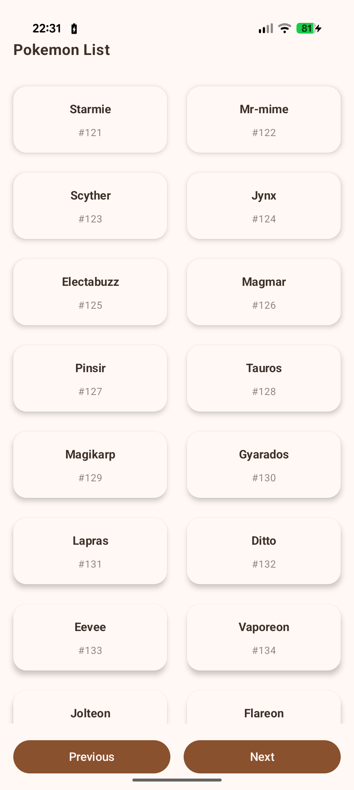
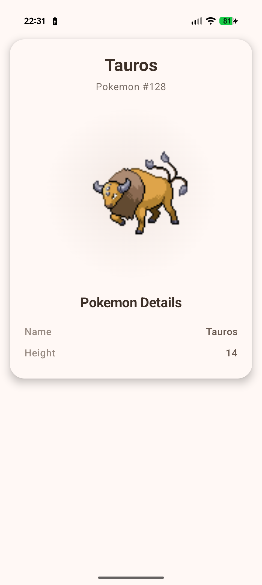

# Pokemon Application

A modern Android application built with Jetpack Compose that displays Pokemon data from the PokeAPI. The app features a clean, intuitive interface for browsing Pokemon lists and viewing detailed information about individual Pokemon.

## 🚀 Features

- **Pokemon List View**: Browse through a paginated list of Pokemon with names and IDs
- **Pokemon Details**: View detailed information about individual Pokemon including:
  - Pokemon name and ID
  - Height and weight
  - Pokemon images
- **Navigation**: Smooth navigation between list and details screens
- **Modern UI**: Built with Material Design 3 and Jetpack Compose
- **Image Loading**: Efficient image loading with Coil
- **Error Handling**: Graceful error handling with user-friendly messages
- **Loading States**: Proper loading indicators during data fetching

## 🏗️ Architecture

The app follows modern Android development best practices:

- **MVVM Architecture**: Model-View-ViewModel pattern for clean separation of concerns
- **Jetpack Compose**: Modern declarative UI framework
- **Navigation Compose**: Type-safe navigation between screens

## 📱 Screenshots

<details>
<summary>Click to view app screenshots</summary>


*Pokemon List Screen - Browse through Pokemon with names and IDs*


*Pokemon Details Screen - View detailed Pokemon information*

The app consists of two main screens:

1. **Pokemon List Screen**: Displays a grid of Pokemon cards with names and IDs
2. **Pokemon Details Screen**: Shows comprehensive Pokemon information in a beautiful card layout

</details>

## 🛠️ Tech Stack

### Core Technologies
- **Kotlin**: Primary programming language
- **Android SDK**: Target SDK 35, Minimum SDK 24
- **Jetpack Compose**: Modern UI toolkit
- **Material Design 3**: Design system

### Libraries & Dependencies

#### UI & Navigation
- **Jetpack Compose BOM**: `2024.09.00`
- **Material 3**: Modern Material Design components
- **Navigation Compose**: `2.9.5` - Type-safe navigation
- **Activity Compose**: `1.11.0` - Compose integration
- **Lifecycle ViewModel Compose**: `2.9.4` - ViewModel integration

#### Networking & Data
- **Retrofit**: `2.9.0` - HTTP client for API calls
- **Gson Converter**: `2.9.0` - JSON serialization/deserialization
- **Coil Compose**: `2.4.0` - Image loading library

#### Core Android
- **AndroidX Core**: `1.17.0` - Core Android functionality
- **Lifecycle Runtime KTX**: `2.9.4` - Lifecycle-aware components

#### Testing
- **JUnit**: `4.13.2` - Unit testing framework
- **Mockito**: `5.1.1` - Mocking framework
- **Mockito Kotlin**: `4.1.0` - Kotlin-friendly mocking
- **Mockito Inline**: `5.1.1` - Inline mocking for final classes
- **Kotlin Coroutines Test**: `1.7.3` - Coroutine testing utilities
- **AndroidX Core Testing**: `2.2.0` - Android testing utilities
- **MockWebServer**: `4.11.0` - HTTP server for testing
- **Espresso**: `3.7.0` - UI testing framework
- **Compose UI Test**: UI testing for Compose


### Installation

1. **Clone the repository**
   ```bash
   git clone https://github.com/kingrocfella/pokemonapp.git
   cd pokemonapp
   ```

2. **Open in Android Studio**
   - Open Android Studio
   - Select "Open an existing project"
   - Navigate to the project directory

3. **Sync Project**
   - Android Studio will automatically sync the project
   - Wait for Gradle sync to complete

4. **Run the App**
   - Connect an Android device or start an emulator
   - Click the "Run" button or press `Shift + F10`

### Building

#### Debug Build
```bash
./gradlew assembleDebug
```

#### Release Build
```bash
./gradlew assembleRelease
```

#### Running Tests
Both Unit and UI tests can be run on Android Studio.

## 📁 Project Structure

```
app/
├── src/
│   ├── main/
│   │   ├── java/com/example/mypokemonapplication/
│   │   │   ├── MainActivity.kt                 # Main activity and navigation
│   │   │   ├── common/
│   │   │   │   ├── api/                        # API service and routes
│   │   │   │   ├── screens/                    # Screen navigation definitions
│   │   │   │   ├── ui/                         # Common UI components
│   │   │   │   └── utils/                      # Utility functions
│   │   │   ├── pokemonlist/                    # Pokemon list feature
│   │   │   │   ├── PokemonListScreen.kt        # List screen composable
│   │   │   │   ├── PokemonListViewModel.kt     # List view model
│   │   │   │   ├── PokemonItem.kt              # Pokemon item composable
│   │   │   │   └── PokemonList.kt              # Data models
│   │   │   ├── pokemondetails/                 # Pokemon details feature
│   │   │   │   ├── PokemonDetailsScreen.kt     # Details screen composable
│   │   │   │   ├── PokemonDetailsViewModel.kt  # Details view model
│   │   │   │   ├── PokemonDetailsViewModelFactory.kt # ViewModel factory
│   │   │   │   └── PokemonDetails.kt           # Data models
│   │   │   └── ui/theme/                       # App theming
│   │   └── res/                                # Resources (layouts, strings, etc.)
│   ├── test/                                   # Unit tests
│   │   └── java/com/example/mypokemonapplication/
│   │       ├── PokemonListViewModelTest.kt     # List ViewModel tests
│   │       ├── PokemonDetailsViewModelTest.kt  # Details ViewModel tests
│   │       └── PokemonItemComposableTest.kt    # Item composable tests
│   └── androidTest/                            # UI tests
│       └── java/com/example/mypokemonapplication/
│           └── PokemonAppEspressoTest.kt       # Espresso UI tests
|__ build.gradle.kts                            # App-level build configuration
```

## 🔧 Configuration

### API Configuration
The app uses the PokeAPI for Pokemon data:
- **Base URL**: `https://pokeapi.co/api/v2/`
- **Endpoints**: 
  - `/pokemon` - Pokemon list with pagination
  - `/pokemon/{id}` - Individual Pokemon details

### Build Configuration
- **Compile SDK**: 36
- **Target SDK**: 35
- **Minimum SDK**: 24
- **Java Version**: 11
- **Kotlin Version**: 2.0.21


